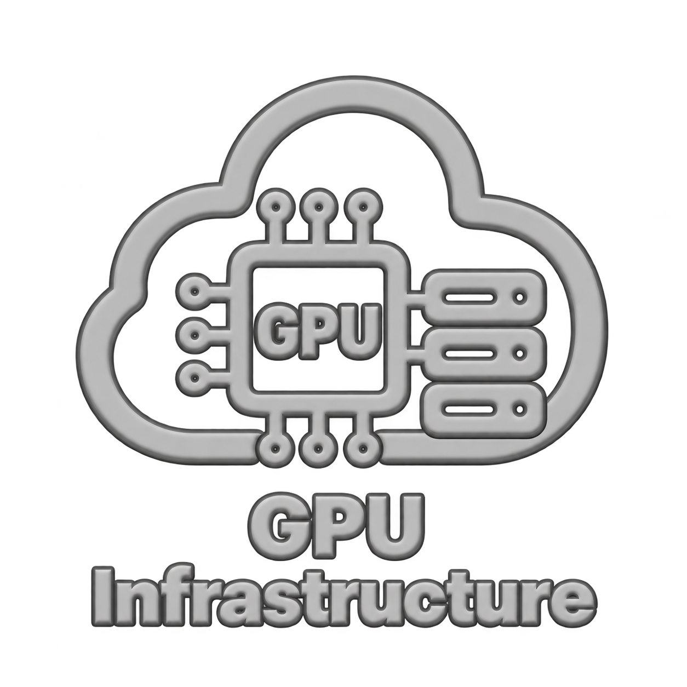
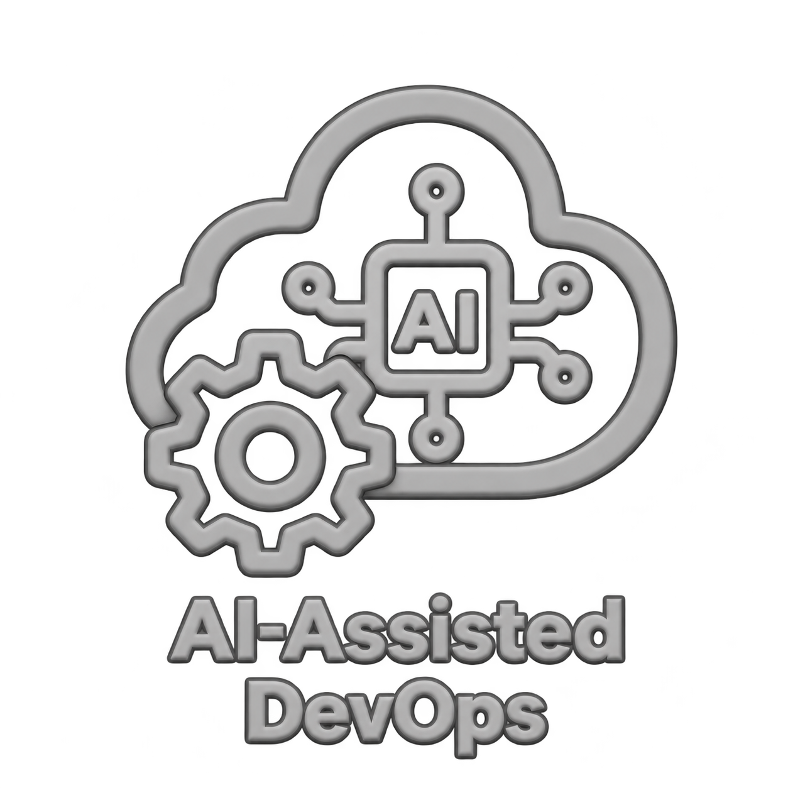

  

<h1 align="center">👋 About CloudDrove</h1>

<em>Reliable cloud platforms. AI-assisted operations. Human accountability.</em>

  <a href="https://clouddrove.com/#contact"><b>Request a free AI-assisted assessment</b></a> ·
  <a href="https://github.com/orgs/clouddrove/repositories"><b>Explore our projects</b></a> ·
  <a href="mailto:business@clouddrove.com"><b>Contact us</b></a>

---

## 🌟 About CloudDrove

CloudDrove helps teams design, build, and run secure, scalable cloud infrastructure. We combine **DevOps engineering, reusable open-source tools, and AI-assisted workflows** to improve delivery, reliability, and cost control.

We work with growing SaaS, healthcare, and fintech teams, from cloud migration and platform engineering to ongoing production operations. Our engineers work alongside your team to make infrastructure easier to manage and evolve.

---

## 👐 Open Source You Can Build On

We build and maintain reusable infrastructure modules and DevOps tools, including code we use on customer platforms. Explore the projects, report issues, and contribute improvements.

| Type | Highlight |
|------|-----------|
| **Terraform Modules** | [AWS](https://github.com/clouddrove?q=terraform-aws&type=all&language=&sort=), [GCP](https://github.com/clouddrove?q=terraform-gcp&type=all&language=&sort=), [DigitalOcean](https://github.com/terraform-do-modules?q=terraform-digitalocean&type=all&language=&sort=), [Azure](https://github.com/orgs/terraform-az-modules/repositories)|
| **Helm Charts** | [helm-charts](https://github.com/clouddrove/helm-charts) |
| **GitHub Actions** | [Shared workflows to standardize CI/CD](https://github.com/clouddrove/github-shared-workflows) |
| **Smurf** | [Explore Smurf](https://smurf.clouddrove.com/) |

**Using our modules in production?** We can help you build and operate the platforms behind them.
[**Request a free AI-assisted assessment**](https://clouddrove.com/#contact) · [Contact our team](mailto:business@clouddrove.com)

---

## 🚀 Our Services

CloudDrove covers the platform lifecycle with six focused service areas. AI supports delivery across these areas, with engineers accountable for the results.

<table width="100%">
  <tr>
    <td width="33%" valign="top">
      

        
      

      <h4 align="center">Cloud &amp; Infrastructure</h4>
      
<b>Cloud Migration · Terraform &amp; IaC · Cost Optimization · Infrastructure Audit</b>

      
Secure migrations, reusable infrastructure, cost control, and architecture reviews.

    </td>
    <td width="33%" valign="top">
      

        
      

      <h4 align="center">Platform Engineering</h4>
      
<b>CI/CD &amp; GitOps · Kubernetes</b>

      
Repeatable delivery workflows and scalable Kubernetes platforms.

    </td>
    <td width="33%" valign="top">
      

        
      

      <h4 align="center">Reliability &amp; Operations</h4>
      
<b>Observability · 24×7 Managed Support · Disaster Recovery</b>

      
Production visibility, support, resilience, and recovery planning.

    </td>
  </tr>
  <tr>
    <td width="33%" valign="top">
      

        
      

      <h4 align="center">Security &amp; Compliance</h4>
      
<b>Zero-Trust &amp; Identity · DevSecOps · Security Audit · Compliance Audit</b>

      
Security controls, delivery checks, and readiness reviews.

    </td>
    <td width="33%" valign="top">
      

        
      

      <h4 align="center">AI Infrastructure</h4>
      
<b>GPU Infrastructure · AI/ML Infrastructure</b>

      
Workload-aware infrastructure for model training and inference.

    </td>
    <td width="33%" valign="top">
      

        
      

      <h4 align="center">AI-Assisted Operations</h4>
      
<b>AI-assisted reviews · Incident triage · Pipeline diagnosis · Cost analysis</b>

      
AI-supported operations with engineer-reviewed findings and approved production changes.

    </td>
  </tr>
</table>

[Explore AI infrastructure capabilities](https://clouddrove.com/ai-infrastructure) · [See how AI supports operations](https://clouddrove.com/intelligence)

---

## 🌍 Where We Build

We build scalable and secure solutions on the world's leading cloud platforms.

<table>
  <tr>
    <td align="center" width="180">
       <b>AWS</b>
    </td>
    <td align="center" width="180">
       <b>Microsoft Azure</b>
    </td>
    <td align="center" width="180">
       <b>Google Cloud</b>
    </td>
    <td align="center" width="180">
       <b>DigitalOcean</b>
    </td>
  </tr>
</table>

---

## 🛠️ What We Use

We select tools around your workloads, existing environment, and operational needs. Our delivery workflows also include GitHub Actions, Azure DevOps, and GitLab CI/CD.

<table>
  <tr>
    <td align="center" width="180">
       <b>Kubernetes</b>
    </td>
    <td align="center" width="180">
       <b>Docker</b>
    </td>
    <td align="center" width="180">
       <b>Terraform</b>
    </td>
    <td align="center" width="180">
       <b>Ansible</b>
    </td>
    <td align="center" width="180">
       <b>Prometheus</b>
    </td>
  </tr>
  <tr>
    <td align="center" width="180">
       <b>Grafana</b>
    </td>
    <td align="center" width="180">
       <b>GitHub</b>
    </td>
    <td align="center" width="180">
       <b>Jenkins</b>
    </td>
    <td align="center" width="180">
       <b>Pulumi</b>
    </td>
    <td align="center" width="180">
       <b>Elastic/ELK</b>
    </td>
  </tr>
</table>

### AI-Assisted Engineering

We use Claude, OpenAI Codex, and Cursor to support engineering workflows, with our engineers reviewing generated code and proposed changes.

<table>
  <tr>
    <td align="center" width="180">
      <a href="https://claude.ai/">
         <b>Claude</b>
      </a>
    </td>
    <td align="center" width="180">
      <a href="https://openai.com/codex/">
         <b>OpenAI Codex</b>
      </a>
    </td>
    <td align="center" width="180">
      <a href="https://cursor.com/">
         <b>Cursor</b>
      </a>
    </td>
  </tr>
</table>

---

## 🤖 How AI and Our Engineers Work Together

AI-assisted engineering combines Claude, OpenAI Codex, and Cursor with purpose-built operational agents across the platform lifecycle. Coding tools support code preparation and review; operational agents analyze infrastructure signals and surface findings for engineers.

| Stage | AI in the workflow | Engineer responsibility |
|---|---|---|
| **Assess & Plan** | Analyze infrastructure configurations and summarize potential reliability, security, and cost issues. | Validate findings, add business context, and agree on priorities. |
| **Build & Review** | Draft Terraform code, suggest pipeline updates, and flag potential configuration issues. | Review code, test changes, and confirm alignment with platform requirements. |
| **Monitor & Investigate** | Analyze alerts, cluster health, and failed pipelines to suggest likely causes and next steps. | Investigate the evidence, confirm the cause, and select the appropriate response. |
| **Approve & Deliver** | Prepare proposed fixes and summarize changes for review. | Approve and execute production changes through the agreed delivery process. |
| **Learn & Improve** | Summarize incident findings and identify recurring issues and cost optimization opportunities. | Verify recommendations and prioritize ongoing platform improvements. |

**Human accountability at every stage.** AI-generated code and findings require engineer review. Production changes require human approval; operational agents do not make autonomous production changes.

---

## ⚙️ How We Work

<table>
  <tr>
    <td width="33%">
      

        
      

      <h3 align="center">Discovery &amp; Planning</h3>
      
We begin with a deep dive to understand your workloads, risks, and goals (performance, cost, compliance).
        Through workshops, assessments, and architecture reviews, we map out where automation, scaling, and security gaps exist.

      
Use AI to review infrastructure and summarize risks during discovery and planning.

      
For AI workloads, match GPU hardware and pricing to training bursts and steady inference needs.

    </td>
    <td width="33%">
      

        
      

      <h3 align="center">Infrastructure as Code</h3>
      
We build using Terraform modules + cloud-native tools. Everything’s codified, versioned, and reusable.
        This ensures you’re not just getting one-off setups, but components you can reliably iterate on.

      
Use AI to draft and review Terraform code, with engineers validating every proposed change.

      
Configure GPU workloads on Kubernetes with scheduling, autoscaling, and recovery built into the platform.

    </td>
    <td width="33%">
      

        
      

      <h3 align="center">CI/CD &amp; GitOps</h3>
      
Fast, safe deployments stem from robust pipelines.
        We set up CI/CD via GitHub Actions / Azure DevOps / GitLab, enforce code review, test automation, and policy-as-code.
        Using GitOps makes infrastructure changes and app deployments auditable & reversible.

      
Use AI to diagnose failed pipelines and prepare fixes for engineer review.

    </td>
  </tr>
  <tr>
    <td width="33%">
      

        
      

      <h3 align="center">Security by Design</h3>
      
Security isn’t an afterthought. Zero-trust thinking, guardrails, least privilege, policy-as-code,
        and secrets management are embedded from day one. We align with cloud-provider and regulatory best practices.

      
Use AI to review configurations and flag potential security risks for investigation.

    </td>
    <td width="33%">
      

        
      

      <h3 align="center">Continuous Monitoring &amp; Improvement</h3>
      
Once in production, the work doesn’t stop. We put in observability (metrics, logging, tracing),
        dig into costs, monitor SLAs/SLOs, and run performance reviews. If something is off, we iterate.

      
Use AI to triage alerts, analyze cluster health, and identify cost optimization opportunities.

      
Review GPU utilization and idle capacity, then tune scheduling and scaling to keep spending aligned with demand.

    </td>
    <td width="33%">
      

        
      

      <h3 align="center">Collaboration &amp; Shared Ownership</h3>
      
We’re not a black box — we deeply collaborate. Regular demos, dashboards, shared ownership,
        and open communication lead to trust, better solutions, and faster learning.

      
Use AI to summarize technical findings and prepare clear updates for shared team reviews.

    </td>
  </tr>
</table>

---

## ✨ What Sets Us Apart

<table width="90%">
  <!-- Card 1 -->
  <tr>
    <td align="center" width="70">🤖</td>
    <td align="left">
      <b>Intelligent Automation &amp; Accelerated Delivery</b> 
      CI/CD, IaC, and reusable patterns reduce friction and help teams ship reliable infrastructure faster.
    </td>
  </tr>
  <tr><td colspan="2">
</td></tr>

  <!-- Card 2 -->
  <tr>
    <td align="center" width="70">💼</td>
    <td align="left">
      <b>Financial Clarity &amp; Savings</b> 
      Proactive right-sizing, reservation management, and clear cost allocation/tagging to maximize your cloud ROI.
    </td>
  </tr>
  <tr><td colspan="2">
</td></tr>

  <!-- Card 3 -->
  <tr>
    <td align="center" width="70">🛡️</td>
    <td align="left">
      <b>Security by Design</b> 
      Enforcing zero-trust guardrails, secrets management, and policy-as-code from day one.
    </td>
  </tr>
  <tr><td colspan="2">
</td></tr>

  <!-- Card 4 -->
  <tr>
    <td align="center" width="70">🌦️</td>
    <td align="left">
      <b>Multi-Cloud Consistency</b> 
      Applying reusable patterns and consistent operating practices across AWS, Azure, Google Cloud, and DigitalOcean while respecting each platform’s capabilities.
    </td>
  </tr>
  <tr><td colspan="2">
</td></tr>

  <!-- Card 5 -->
  <tr>
    <td align="center" width="70">🧠</td>
    <td align="left">
      <b>AI-Assisted Operations &amp; Human Accountability</b> 
      AI reviews code, analyzes platform signals, triages incidents, and surfaces cost opportunities; a named engineer validates findings and approves production changes.
    </td>
  </tr>
</table>

---

## 🏗️ Join Our Slack Community

Connect with other practitioners in our open-source DevOps community to share knowledge, discuss cloud challenges, and learn together.

- Exchange practical ideas with the DevOps community.
- Learn about cloud infrastructure, automation, and emerging tools.
- Share experiences and grow your skills alongside other engineers.

[**Join our Slack community**](https://www.launchpass.com/devops-talks)

---

## 📚 Explore Our Blog

[Read the CloudDrove blog](https://blog.clouddrove.com/) for practical cloud and DevOps insights.

---

## 🤝 Let’s Improve Your Cloud Platform

Looking to simplify operations, improve deployment reliability, or understand your cloud costs?

Request a **free AI-assisted assessment**. Tell us about your environment and the challenges you want to address so we can discuss the scope and next steps.

[**Request an assessment**](https://clouddrove.com/#contact)

### 📬 Get in Touch

| 🌐 Website | ✉️ Email |
|----------|------------|
| [clouddrove.com](https://clouddrove.com) | [business@clouddrove.com](mailto:business@clouddrove.com) |

