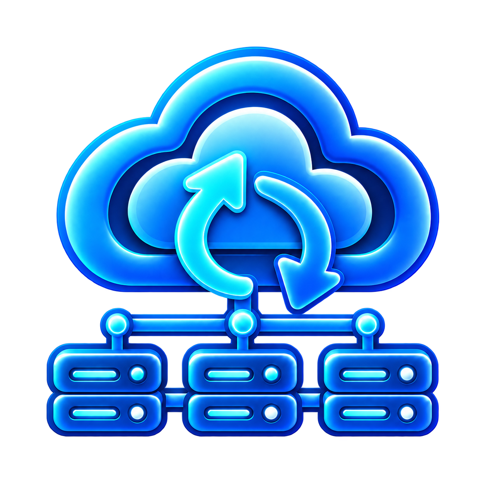
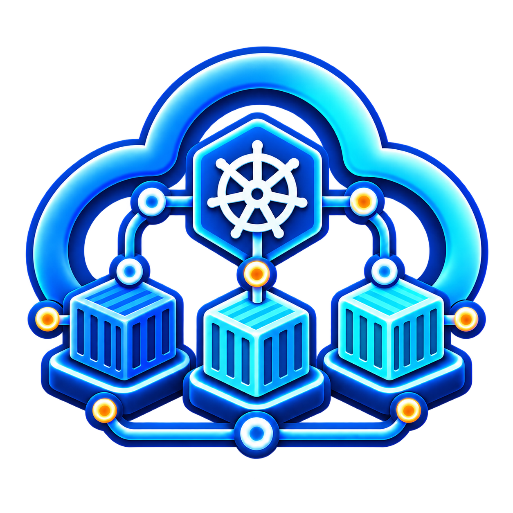
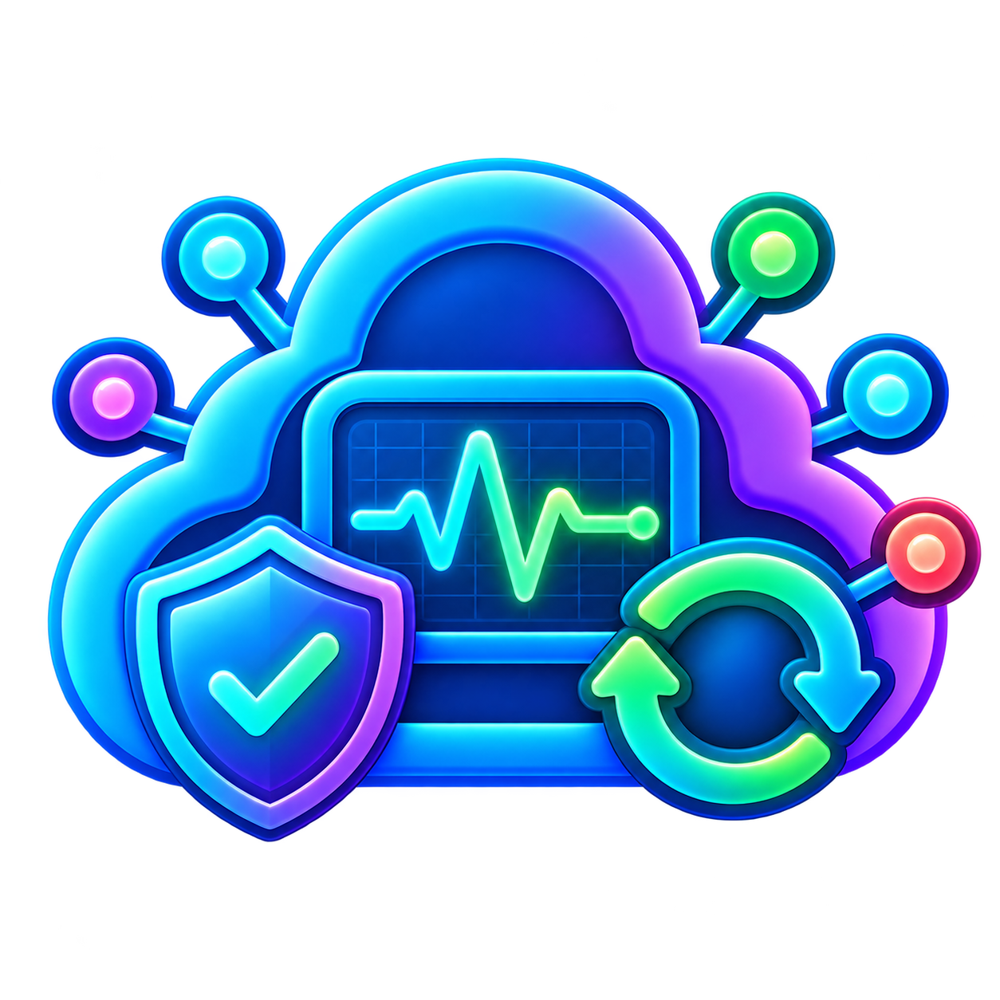
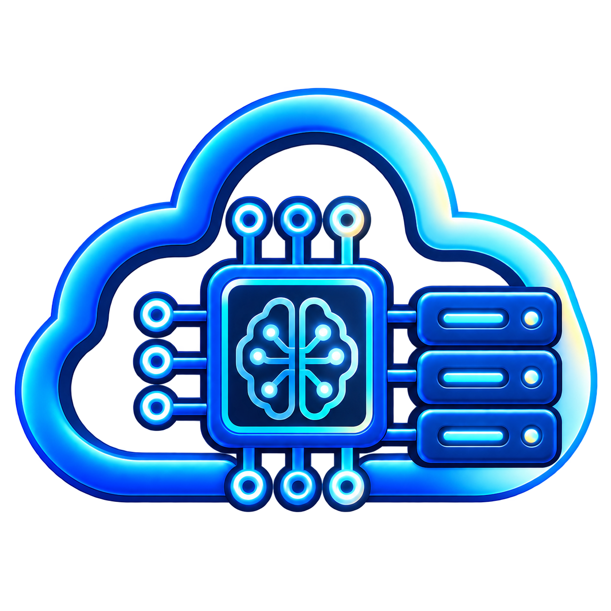
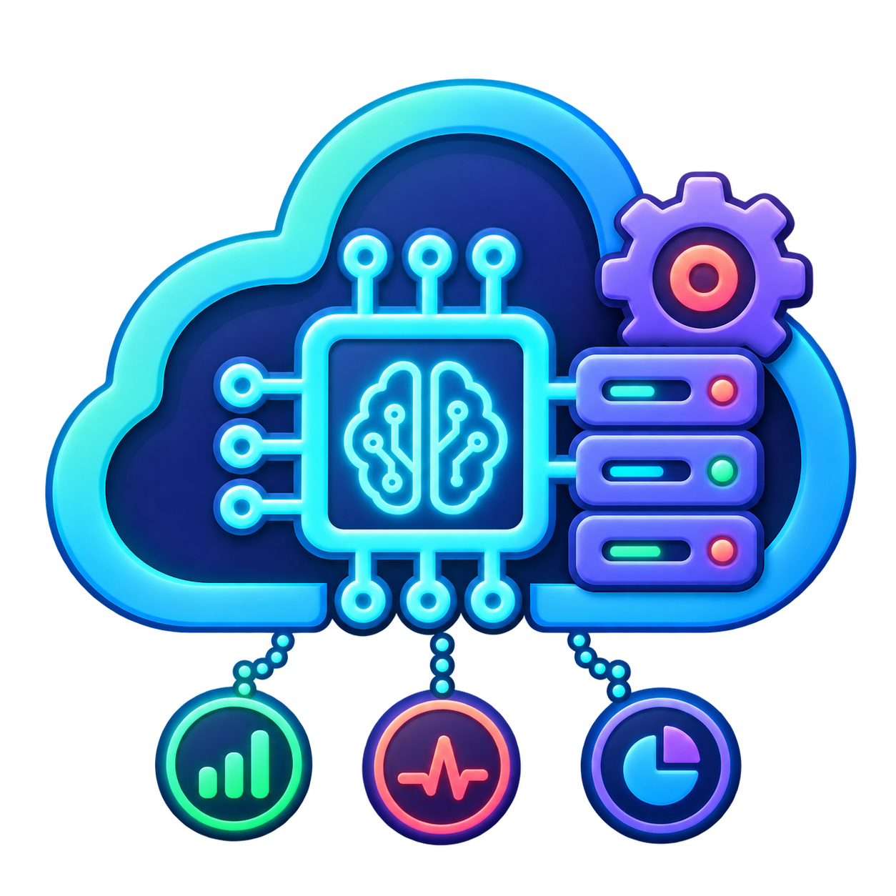

  

<h1 align="center">👋 About CloudDrove</h1>

<em>Reliable cloud platforms. AI-assisted operations. Human accountability.</em>

  <a href="https://clouddrove.com/contact"><b>Request a free cloud infrastructure assessment</b></a> ·
  <a href="https://github.com/orgs/clouddrove/repositories"><b>Explore our projects</b></a> ·
  <a href="mailto:hello@clouddrove.com"><b>Contact us</b></a>

---

## 🌟 About CloudDrove

CloudDrove is an AI-operated cloud and DevOps partner based in Toronto, Canada. We design, build and run production platforms for growth-stage SaaS, healthcare and fintech teams (Kubernetes, CI/CD, Terraform, observability and security) and operate them 24x7 with purpose-built AI agents supervised by senior engineers. Every agent output is human-reviewed; nothing changes in production without a named engineer's sign-off. We open-source what we build: 200+ Terraform modules and tools used by thousands of teams. Working across US and European time zones.

---

## 👐 Open Source You Can Build On

We build and maintain reusable infrastructure modules and DevOps tools, including code we use on customer platforms. Explore the projects, report issues, and contribute improvements.

| Type | Highlight |
|------|-----------|
| **Terraform Modules** | [AWS](https://github.com/clouddrove?q=terraform-aws&type=all&language=&sort=), [GCP](https://github.com/clouddrove?q=terraform-gcp&type=all&language=&sort=), [DigitalOcean](https://github.com/terraform-do-modules?q=terraform-digitalocean&type=all&language=&sort=), [Azure](https://github.com/orgs/terraform-az-modules/repositories)|
| **Helm Charts** | [helm-charts](https://github.com/clouddrove/helm-charts) |
| **GitHub Actions** | [Shared workflows to standardize CI/CD](https://github.com/clouddrove/github-shared-workflows) |
| **Smurf** | [Explore Smurf](https://smurf.clouddrove.com/) |

**Using our modules in production?** We can help you build and operate the platforms behind them.

---

## 🚀 Our Services

Six focused service areas cover the platform lifecycle, with AI-assisted delivery and engineer accountability throughout.

<table width="100%">
  <tr><td width="96" valign="middle"></td><td valign="middle"><b>Cloud &amp; Infrastructure</b> Cloud migration, Terraform &amp; IaC, cost optimization, and infrastructure audits.</td></tr>
  <tr><td valign="middle"></td><td valign="middle"><b>Platform Engineering</b> CI/CD, GitOps, Kubernetes, and repeatable developer platforms.</td></tr>
  <tr><td valign="middle"></td><td valign="middle"><b>Reliability &amp; Operations</b> Observability, disaster recovery, and 24×7 managed support.</td></tr>
  <tr><td valign="middle"></td><td valign="middle"><b>Security &amp; Compliance</b> Zero-trust identity, DevSecOps, security audits, and compliance audits.</td></tr>
  <tr><td valign="middle"></td><td valign="middle"><b>AI Infrastructure</b> GPU infrastructure and AI/ML platforms for training and inference.</td></tr>
  <tr><td valign="middle"></td><td valign="middle"><b>AI-Assisted Operations</b> Engineer-reviewed incident triage, pipeline diagnosis, and cost analysis.</td></tr>
</table>

[Explore AI infrastructure capabilities](https://clouddrove.com/ai-infrastructure) · [See how AI supports operations](https://clouddrove.com/intelligence)

---

## 🛠️ What We Use

**Cloud:** AWS · Microsoft Azure · Google Cloud · DigitalOcean
**Infrastructure:** Terraform · Pulumi · Ansible · Kubernetes · Docker
**Delivery & observability:** GitHub Actions · Azure DevOps · GitLab CI/CD · Jenkins · Prometheus · Grafana · Elastic
**AI-assisted engineering:** Claude · OpenAI Codex · Cursor

## 🤖 How AI and Our Engineers Work Together

AI-assisted engineering combines Claude, OpenAI Codex, and Cursor with purpose-built operational agents across the platform lifecycle. Coding tools support code preparation and review; operational agents analyze infrastructure signals and surface findings for engineers.

| Stage | AI in the workflow | Engineer responsibility |
|---|---|---|
| **Assess & Plan** | Analyze infrastructure configurations and summarize potential reliability, security, and cost issues. | Validate findings, add business context, and agree on priorities. |
| **Build & Review** | Draft Terraform code, suggest pipeline updates, and flag potential configuration issues. | Review code, test changes, and confirm alignment with platform requirements. |
| **Monitor & Investigate** | Analyze alerts, cluster health, and failed pipelines to suggest likely causes and next steps. | Investigate the evidence, confirm the cause, and select the appropriate response. |
| **Approve & Deliver** | Prepare proposed fixes and summarize changes for review. | Approve and execute production changes through the agreed delivery process. |
| **Learn & Improve** | Summarize incident findings and identify recurring issues and cost optimization opportunities. | Verify recommendations and prioritize ongoing platform improvements. |

**Human accountability at every stage.** AI-generated code and findings require engineer review. Production changes require human approval; operational agents do not make autonomous production changes.

---

## ✨ What Sets Us Apart

- **Intelligent Automation & Accelerated Delivery** — CI/CD, IaC, and reusable patterns help teams ship reliable infrastructure faster.
- **Secure, Efficient Multi-Cloud Operations** — Security by design, cost clarity, and consistent practices across AWS, Azure, Google Cloud, and DigitalOcean.
- **AI-Assisted Operations & Human Accountability** — AI reviews code, analyzes platform signals, triages incidents, and surfaces cost opportunities; a named engineer validates findings and approves production changes.

---

## 🌐 Explore and Connect

- [Join our DevOps Slack community](https://www.launchpass.com/devops-talks) to share knowledge and learn with other practitioners.
- [Read the CloudDrove blog](https://blog.clouddrove.com/) for practical cloud and DevOps insights.
- [Read our website blog](https://clouddrove.com/blog) for company updates and cloud engineering insights.
- [Explore our repositories](https://github.com/orgs/clouddrove/repositories) and contribute to our open-source tools.

## 🤝 Let’s Improve Your Cloud Platform

Looking to simplify operations, improve deployment reliability, or understand your cloud costs?

Request a **free cloud infrastructure assessment**. Tell us about your environment and the challenges you want to address so we can discuss the scope and next steps.

[**Request an assessment**](https://clouddrove.com/contact)

### 📬 Get in Touch

| 🌐 Website | ✉️ Email |
|----------|------------|
| [clouddrove.com](https://clouddrove.com) | [hello@clouddrove.com](mailto:hello@clouddrove.com) |

